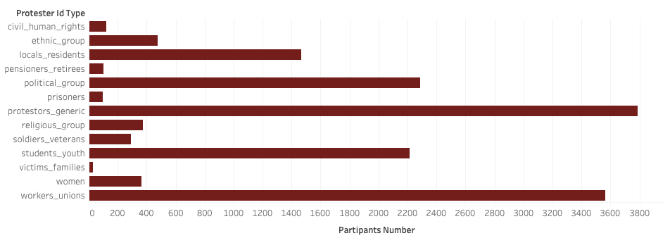
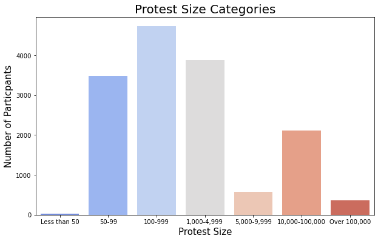
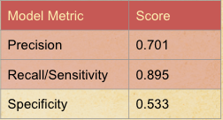
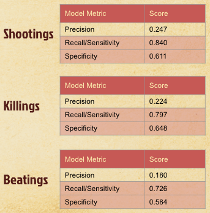
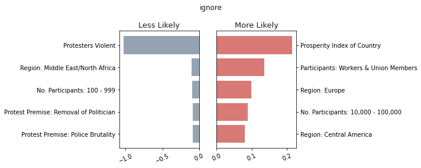
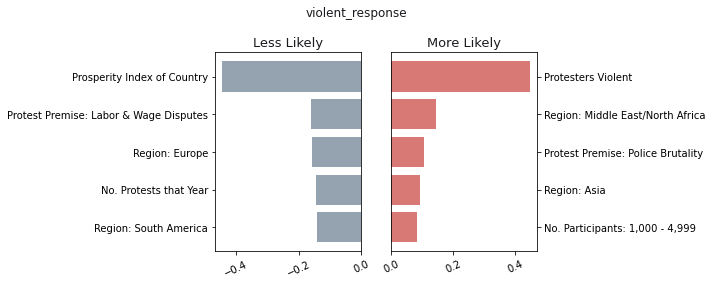

# **Mass Mobilization**

## Table of Contents

1. [Executive Summary](#1.-Executive-Summary)
2. [Data Collection](#2.-Data-Collection)
3. [Data Cleaning & Pre-Processing](#3.-Data-Cleaning-&-Pre-Processing)
4. [EDA](#4.-EDA)
5. [Modeling](#5.-Modeling)
6. [Evaluation & Analysis](#6.-Evaluation-&-Analysis)
7. [Conclusion & Recommendations](#7.-Conclusion-&-Recommendations)
8. [Next Steps & Future work](#8.-Next-Steps-&-Future-work)
9. [Citations](#9.-Citations)
10. [Acknowledgements](#10.-Acknowledgements)

## 1. Executive Summary

In light of the mass mobilization events over the past year, protests are basically commonplace in modern day America. More importantly, the way the US government responds is under increasing scrutiny. For this reason, the US government ought to have better tools for understanding and preparing for protests and demonstrations.

The Mass Mobilization Project is a site that hosts data about citizen movements against governments. The original intent of the MM study was to inform foreign policy and understand the impact of mass mobilizations outside the United States. The data contains around 17,000 protests where 50 or more individually publically protested against government. More information can be found at the website: massmobilization.github.io. 

Our goal is to prepare the data for machine learning modeling and predict a government's response. In the end, we hope that given a good product that makes reasonably accurate predictions, we can yield meaningful insights from the data, infer relationships between public protests and governments responses, and add context to the ongoing conversation of protests in America.

## 2. Data Collection

We gathered data from the Mass Mobilization Project ([*source*](https://massmobilization.github.io/about.html)), which scraped information about over 17,000 different protests across the world from the *New York Times*, *Washington Post*, *Christian Science Monitor*, and *Times of London* from 1990-2020.

We also gathered data from the UN ([*source*](https://population.un.org/wpp/Download/Standard/CSV/)) regarding population metrics for each of the countries in the Mass Mobilization data set and the Legatum Institute ([*source*](https://www.prosperity.com/about/methodology)) for information regarding the prosperity of regions and countries in the data. 

## 3. Data Cleaning & Pre-Processing

The data was gathered by scraping various news publication platform. As a result, the majority of the data was clunky and more or less open to interpretation, which is not ideal for machine learning. 

## 4. EDA

After the end of the data cleaning phase, we are left with one large main dataframe, which contains around 15,000 rows of data. At this stage, all categorical features columns have been encoded into a large collection of binary columns to represent each country, protestor category, protester type, etc. The new total number of columns at this state becomes 235.

Some analysis reveals the distribution of some of the input features.

 

After considering the possible effects using all of the encoded country names, we determined that doing that might add too many unimportant features, since a protest's general location is captured in a 'Region' field.

Some extra analysis was done running the text contained in the **notes** field through a Natural Language Processor, but this could have introduced information that is too highly correlated to the model's target variables, and was Ultimately not used as an input feature.  For example, a negative description in the **notes** field might skew the results.

After removing all country and any other features deemed unnecessary, the set of data to be passed into our models was reduced to approximately 70 columns.

## 5. Modeling

At first glance, we were presented with a multi-label classification problem i.e. a government can have multiple responses to the same protest. For these reasons, we initially built a couple of models: a Neural Network and a sklearn Multilabel Classifier using bagging and random forests ensemble methods. Our neural network model was promising given the first iteration, but we quickly realized we could not interpret any meaningful insights from it. Our Multilabel Classifier did not perform well. 

For the second modeling effort, we built seven different logistic regressions for each of our target variables, effectively running a binary classification on each class. The results for these models varied widely and predictions were not reliable for classses that were less frequent in the data. This is a pitfall for having massively imbalanced data. More importantly to our interests, the violent responses were massively underepresented. 

The third modeling effort was a slight spinoff from our second modeling effort. First, we ran a binary logistic regression on whether or not the state government ignored a protest. After running this model, we filtered our data to exclude points where the government did not ignore a protest (i.e. which can be interpeted as when the government did respond). We then ran six different binary logistic regressions for each of the remaining six variables. Treating the ignore logistic regression separately reduced imbalances in our data and improved our scores across the board, especially for our columns of interest: the violent responses. 

Given a decent product, we ran a gridsearch on several hyperparameters with an emphasis on the 'class_weight' of our logistic regression, which effectively penalizes wrong predictions for the class at hand based on a ratio default is 1:1). 

We even went a step further and grouped all three of the violent responses--beatings, killiings, and shootings--into one 'violent_response' column in order to reduce imbalances even more. However, this did not increase the scores of our model. 

Please see the images folder in our repo for our final modeling technique's performance metrics, confusion matrices, and AUC plots. 

## 6. Evaluation & Analysis

| Target          | cross val | specificity | precision | recall   |
|-----------------|-----------|-------------|-----------|----------|
| ignore          | 0.787     | 0.533       | **0.700** | **0.894**|
| crowd dispersal | 0.726     | 0.316       | **0.727** |**0.899** |                             
| arrests         | 0.619     | 0.276       | **0.343** | **0.861**|                            
| accomodation    | 0.726     | 0.735       | **0.364** | **0.581**|
| killings        | 0.779     | **0.648**   | 0.224     | **0.797**|
| beatings        | 0.793     | **0.595**   | 0.242     | **0.852**|
| shootings       | 0.683     | **0.584**   | 0.180     | **0.726**|

When evaluating multiple targets, some of which are desirable and some not, metric selection can be complicated. In addition, the imbalanced classes in our data impacted some metrics more than others. We considered the following metrics with the following conclusions:
|Metric|Description|Usefulness in our Analysis|
|---|---|---|
|Confusion Matrix & Metrics|True Positive (TP), True Negatives (TN), False Positives (FP), False Negatives (FP)|These four metrics break out every prediction made by the model and classifies them by whether or not an outcome happened in reality (Positive, Negative) and whether the model predicted that outcome or not (True, False). These metrics are the building blocks for the measures below, some of which were beneficial to our analysis and some of which were not.|
|Accuracy Score|Number of correct predictions (TP & TN) over all predictions|Not useful for our models due to imbalance. Small classes are never predicted, but model still achieves strong accuracy simply by predicting majority class.|
|Precision Score|Number of accurate positive predictions (TP) over all positive predictions (TP & FP).|Useful when predicting non-violent outcomes, like Ignore or Crowd Dispersal. Precision optimizes for True positives and limits True negatives, and allows for higher False Negatives. In this case, it is better to incorrectly assume too few non-violent responses, than to predict too many, which would mean you'd end up with a potentially violent response.|
|Specificity Score|Number of accurate negative predictions (TN) over all negatives (TN & FP).|Useful when predicting violent responses, especially when Beatings, Shootings, Killings are rolled together as a single target. The "negative" outcome when the target is violent is actually a non-violent outcome. In general, we would not want to predict a non-violent (FN) response when it was actually violent (TP). Specificity minimizes these false negatives, making it a good metric when dealing with the violent target variable.|  
|Recall/Sensitivity|Number of accurate positive predictions (TP) over all positives (TP & FN).|Recall is a good measure for understanding the effectiveness of your model to accurately predict the positive of your target variable. In this case, recall can inform both violent and non-violent targets, as it isolates situations where the target did happen (positive) and looks at the accuracy of predicting that positive. Because of the imbalance in our classes, this measure is more useful than accuracy, because it narrows in on just positive targets. The higher the recall score when predicting a minority class, the more the model was above to overcome the imbalance issues.|
Our final models performed on these key metrics as follows:
#### Model Predicting State Response: Ignore

When predicting a target of "Ignore", a non-violent state response, Precision and Recall are most important. As you can see above, our final Logistic Regression model achieved a .70 Precision, and .90 Recall.  
#### Model Predicting State Responses: Beatings, Shootings, Killings

Because these are violent state responses, we want to focus on Specificity and Recall with these models. With Specificity scores ranging from .58 to .65, and Recall ranging from .73 to .84, these final models are finding ways to correct the natural imbalance in the data. More tuning could continue to improve these scores and improve the usefulness of the model for forward.  

## 7. Conclusion 

Given a model with reasonable scores, we were most interested in highlighting relationships in the data when the government either ignores protests or violently responds to them. Conclusions for the ignore target were relatively straight forward and expected. For instance, governments were more likely to ignore protests in countries with a higher prosperity index score. An interesting nuance in the findings is governments were less likely to ignore small protests and more likely to ignore larger protests. Intuitively, perhaps larger protests are more organized and anticipated whereas smaller protests are unpredictable, which is more likely to raise uncertainty for the government at hand. 

As for violent responses, all three target variables (killings, shootings, and beatings) had similar important features. Obviously, if protesters were violent, the government responded violently. Europe was an important feature when the government is less likely to respond violently for two of the categories, and Asia was an important feature for violent responses of two of the categories as well.

All in all, it was a generally mixed bag as these relationships over a few dozen features is complex, but we feel good about our model and it's scores and feel relatively confident about any inferences our model reveals. 

More photos are available in the images folder. 

## 8. Next Steps & Future work

Given the nature the data and discourse, our goal for this project is to model state responses to protests in order to inference relationships between the data and state responses for further exploration. We believe there is significant work to be finished. Some areas include focusing on gathering more information and more effective non-categorical information for the variables our model deems as predictive for violent responses.

We also believe it is prudent to perform a similar analysis to ours with respect to individual countries. If that is too granular, then by continent. 

In terms of the modeling, we believe our model can be improved and it's worth considering a couple of techniques. To balance the data more sufficiently, bootstrapping techniques might be applied and improve the classification metrics of our models. It's also possible that we could implement unsupervised clustering techniques to group variables and perform analysis on those clusters. Perhaps, there are inferences that can be observed that were not observed with our models. 

Ultimately, gathering more data for the sake of creating more balanced classes would improve the predictive power of our models and the interpretability of them. With this in mind, we also believe it is prudent and absolutely necessary to gather the same data about US protests so that we can learn about mass mobilization at home. 

## 9. Acknowledgements

<<<<<<< HEAD
All of our data and inspiration for our project is from "The Mass Mobilization Project" conducted by Professor David H. Clark from Bighamton Universty and Professor Patrick M. Regan from the University of Notre Dame. 

Thank you for your work in retreiving the data and providing a site for further exploration.
=======
All of our data and inspiration for our project is from "The Mass Mobilization Project" conducted by Professor David H. Clark from Bighamton Universty and Professor Patrick M. Regan from the University of Notre Dame.

Thank you for your work in retrieving the data and providing a site for further exploration.
>>>>>>> 19294994ae94104b48583ead5fa0bd65591e3377
